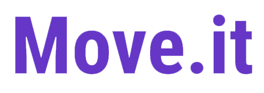
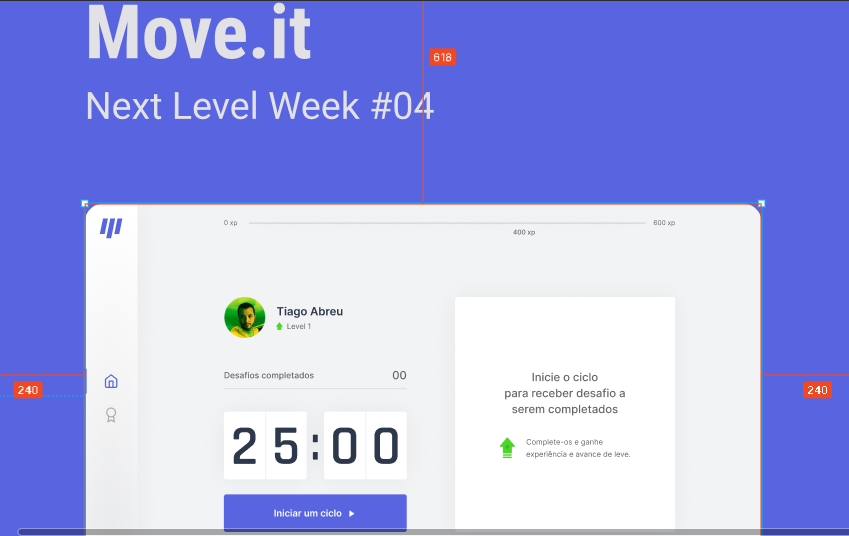

<h1 align="center">
    
</h1>

  <a href="#-tecnologias">Tecnologias</a>&nbsp;&nbsp;&nbsp;|&nbsp;&nbsp;&nbsp;
  <a href="#-projeto">Projeto</a>&nbsp;&nbsp;&nbsp;|&nbsp;&nbsp;&nbsp;
  <a href="#-layout">Layout</a>&nbsp;&nbsp;&nbsp;|&nbsp;&nbsp;&nbsp;
  <a href="#memo-licença">Licença</a>

 

  

 

  

## 🚀 Tecnologias

Esse projeto foi desenvolvido com as seguintes tecnologias:

- [Node.js](https://nodejs.org/en/)
- [React](https://reactjs.org)
- [Next.js](https://nextjs.org)
- [TypeScript](https://www.typescriptlang.org/)

## 💻 Projeto

O Move.it é uma aplicação do tipo pomodoro gaming, unindo foco, saúde laboral e competitividade💜

## 🔖 Layout

Nos links abaixo você encontra o layout do projeto web. Lembrando que você precisa ter uma conta no [Figma](http://figma.com/) para acessá-lo.

- [Layout](https://www.figma.com/file/mK0RZ4IPHDklCywzoEIwdJ/Move.it-1.0)

## 🧠 Agradecimento

A aplicação foi publicada durante a 4ª semana Next Level Week e serviu para meus estudos nas tecnologias acima citadas.
Pretendo criar novos projetos utilizando esta aplicação como base, deste já agradeço a Rocketseat e todos os seus colaboradores.

## :memo: Licença

Esse projeto está sob a licença MIT. Veja o arquivo [LICENSE](LICENSE) para mais detalhes.

---

Codado com muita alegria e filhas no colo ♥ by [Tiago de Abreu] (http://atriostech.com.br/tiago/) :wave: 

